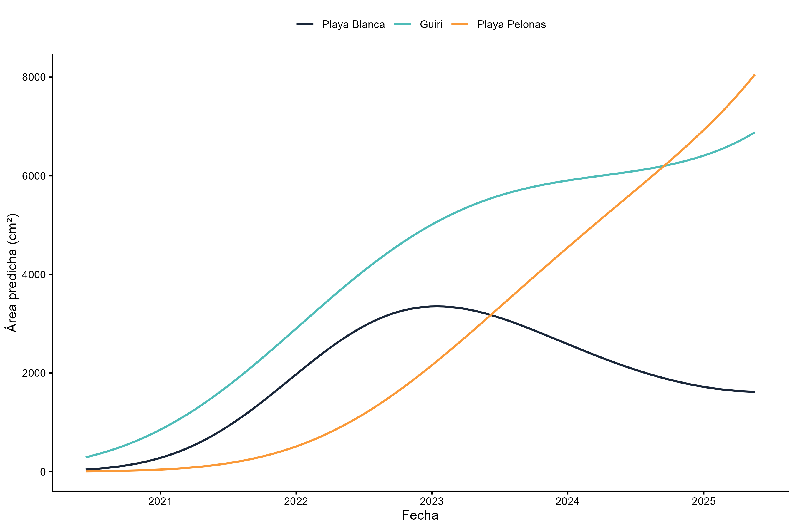
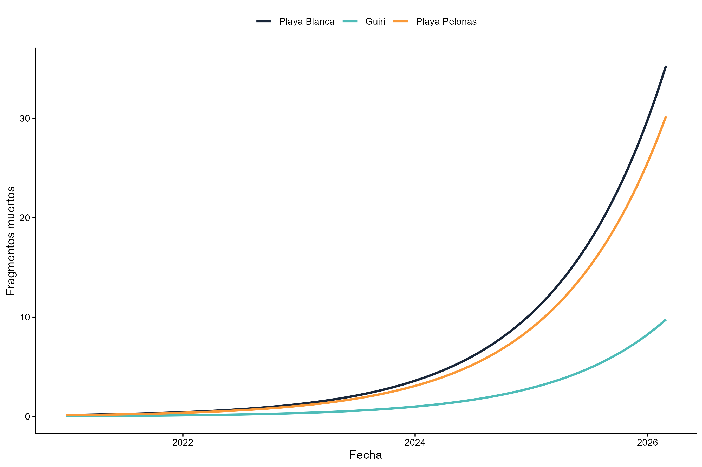
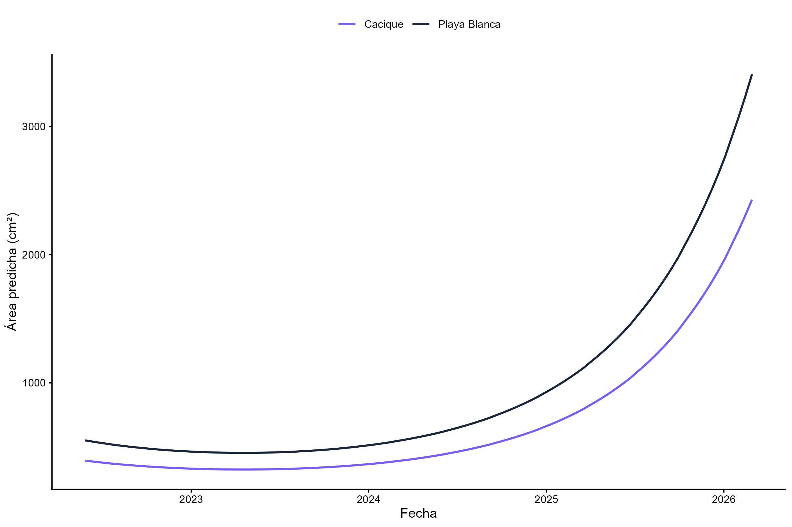
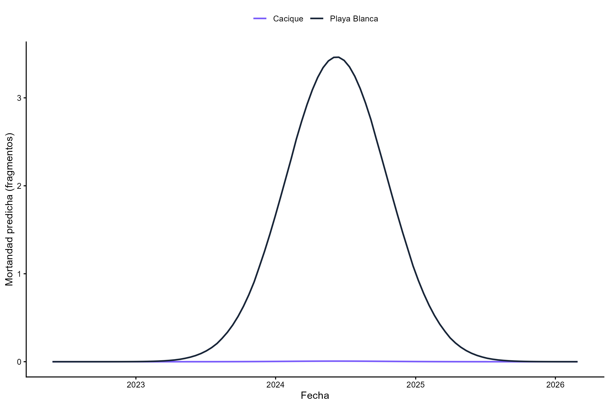

# Introducción

Este informe resume los resultados de los análisis realizados sobre el proyecto de estructuras coralinas, incluyendo tanto las estructuras grandes como las pequeñas. Se presentan los datos utilizados, la metodología estadística aplicada, y los resultados principales para las variables de área y mortalidad.

# Materiales y métodos

## Datos

Se emplearon dos conjuntos de datos procesados:

- `data/processed/big_agg.rds`: datos agregados de estructuras grandes, con observaciones mensuales por estructura, área total (`area_cm2`), número de fragmentos (`num_frag`), mortalidad (`mort`) y sitio (`site`).
- `data/processed/final_small.rds`: datos de estructuras pequeñas, con registros por fotografía y variables equivalentes de área, mortalidad y fragmentos.

En ambos casos se limpiaron los conjuntos eliminando observaciones con valores faltantes en las variables relevantes para el modelado. Además, se verificó la cobertura temporal y la distribución de observaciones por sitio para asegurar que los resultados representaran adecuadamente las diferentes etapas del proyecto.

## Modelos de área

La variable respuesta para el crecimiento de las estructuras fue `area_cm2`. Para ambas escalas se evaluaron modelos mixtos generalizados que incorporan el efecto fijo de sitio y un intercepto aleatorio por estructura (`str_code`) para capturar la correlación entre observaciones repetidas.

Para las estructuras grandes se utilizó un modelo Tweedie con enlace logarítmico, debido a la distribución positiva y sesgada de la superficie. La formulación final para este conjunto fue:

- `area_cm2 ~ poly(gira, 3) * site + (1 | str_code)`

En el caso de las estructuras pequeñas, el modelo final se simplificó a:

- `area_cm2 ~ poly(gira_rel, 2) + site + (1 | str_code)`

La elección de un modelo polinómico de segundo orden para las estructuras pequeñas responde a la necesidad de captar tendencias no lineales sin sobreajustar.

## Modelos de mortalidad

La mortalidad se modeló para cada conjunto de datos con la variable `mort` como respuesta y se incluyó un offset de `log(num_frag)` para ajustar por el tamaño relativo de cada estructura observada.

Para estructuras grandes se empleó un modelo de regresión con familia binomial negativa:

- `mort ~ gira + site + offset(log(num_frag)) + (1 | str_code)`

Para estructuras pequeñas se consideraron varios candidatos y se seleccionó el siguiente modelo por su balance entre ajuste y estabilidad numérica:

- `mort ~ poly(gira_rel, 2) + site + offset(log(num_frag)) + (1 | str_code)`

La familia binomial negativa (`nbinom2`) fue preferida para manejar sobredispersión en los conteos de fragmentos muertos.

## Evaluación de modelos

Los ajustes fueron evaluados mediante criterios de información (AIC/BIC), diagnóstico de residuos con el paquete `DHARMa`, y revisión de la estabilidad de los parámetros. Se descartaron formulaciones con problemas de convergencia o Hessianos no definidos.

# Resultados

## Estructuras grandes

El modelo de área predice que Playa Pelonas es el sitio con el mejor desempeño en estructuras grandes. Allí el área crece de manera sostenida y termina por encima de Playa Blanca y Guiri, lo que sugiere condiciones más favorables para la acumulación de superficie de los fragmentos.

Playa Blanca, en cambio, aparece como el sitio con menor crecimiento predicho. Si bien comienza con valores similares a los demás, su curva se nivela antes y alcanza una área menor, indicando un potencial límite en la tasa de expansión de los fragmentos.

Guiri se sitúa en un punto intermedio: crece mejor que Playa Blanca, pero no alcanza el ritmo de Playa Pelonas. Esto sugiere que Guiri mantiene un estado relativamente estable, aunque sin la misma aceleración de crecimiento que se observa en Playa Pelonas.

En mortalidad de estructuras grandes, el modelo muestra que Playa Blanca es el sitio con mayor número de fragmentos muertos predicho, seguido por Playa Pelonas. La mayor mortalidad relativa en Playa Blanca confirma que ese sitio tiene tanto un crecimiento más débil como una pérdida mayor de fragmentos.

Guiri presenta la mortalidad más baja entre los tres sitios, lo que indica que sus fragmentos grandes sobreviven mejor a lo largo del periodo. Esa combinación de mortalidad reducida y crecimiento intermedio sugiere que Guiri podría ser un sitio adecuado para mantener estructuras grandes más estables.

## Estructuras pequeñas

Para las estructuras pequeñas, el modelo de área muestra que Playa Blanca crece más que Cacique. La curva de Playa Blanca se eleva de manera más notable hacia el final del periodo, mientras que Cacique avanza de forma más suave y constante.

Aunque Playa Blanca produce más área en las estructuras pequeñas, Cacique da señales de un crecimiento más mesurado. Esto puede significar que los fragmentos de Cacique se desarrollan con menos oscilaciones y con una menor exposición a picos de crecimiento rápidos.

En mortalidad de estructuras pequeñas, Cacique prácticamente no aumenta su número de fragmentos muertos en el modelo, mientras que Playa Blanca tiene un pico claro alrededor de 2024. Ese contraste convierte a Cacique en el sitio más resiliente dentro de las estructuras pequeñas: sus fragmentos pierden poca unidad y mantienen una mortandad muy baja.

# Discusión breve

Los resultados muestran que las diferencias entre sitios son reales y útiles para interpretar los procesos en el proyecto. Playa Blanca combina menor crecimiento con mayor mortalidad en las estructuras grandes, lo que la convierte en el sitio de mayor riesgo para la estabilidad del ensamble.

Playa Pelonas destaca por su alto crecimiento en estructuras grandes, aunque su mortalidad también es moderada. Esto sugiere que el sitio favorece la expansión, pero no necesariamente protege mejor contra la pérdida de fragmentos.

Guiri mantiene una mortalidad baja en estructuras grandes y un crecimiento intermedio, lo que sugiere un desempeño más equilibrado. En este sitio, el manejo podría enfocarse en sostener esas condiciones estables.

Cacique, en las estructuras pequeñas, aparece como el sitio más resistente. Sus fragmentos crecen de manera constante y presentan muy poca mortalidad. Esa combinación es valiosa para plantear estrategias de conservación basadas en fragmentos con menor riesgo de pérdida.

En resumen, los modelos no solo describen la dinámica de área y mortalidad, sino que permiten distinguir comportamientos concretos por sitio: Playa Blanca es más vulnerable, Playa Pelonas tiene mayor crecimiento, Guiri ofrece estabilidad en estructuras grandes y Cacique muestra resistencia en estructuras pequeñas.
